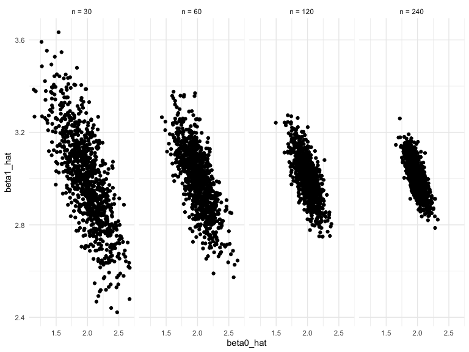

Writing Functions
================

## Simulation: SLR for one n

``` r
sim_regression = function(n, beta0 = 2, beta1 = 3) {
  
  sim_data = tibble(
    x = rnorm(n, mean = 1, sd = 1),
    y = beta0 + beta1 * x + rnorm(n, 0, 1)
  )
  
  ls_fit = lm(y ~ x, data = sim_data)
  
  tibble(
    beta0_hat = coef(ls_fit)[1],
    beta1_hat = coef(ls_fit)[2]
  )
}
```

``` r
sim_regression(n = 30)
```

    ## # A tibble: 1 x 2
    ##   beta0_hat beta1_hat
    ##       <dbl>     <dbl>
    ## 1      2.09      3.04

## repeat sampling using for loop…

``` r
output = vector("list", length = 5000)

for (i in 1:5000) {
  output[[i]] = sim_regression(n = 30)
}

bind_rows(output) %>% 
  ggplot(aes(x = beta0_hat)) + geom_density()
```

<!-- -->

## repeat sampling using purr

``` r
output = rerun(5000, sim_regression(n = 30)) %>% 
  bind_rows()
```

``` r
output %>% 
  ggplot(aes(x = beta0_hat, y = beta1_hat)) + 
  geom_point()
```

<!-- -->

``` r
output %>% 
  pivot_longer(
    beta0_hat:beta1_hat,
    names_to = "parameter", 
    values_to = "estimate") %>% 
  group_by(parameter) %>% 
  summarize(emp_mean = mean(estimate),
            emp_var = var(estimate)) %>% 
  knitr::kable(digits = 3)
```

| parameter  | emp\_mean | emp\_var |
| :--------- | --------: | -------: |
| beta0\_hat |     2.005 |    0.072 |
| beta1\_hat |     2.995 |    0.037 |

## try another sample size

``` r
n_list = list(
  "n_30" = 30,
  "n_60" = 60,
  "n_120" = 120,
  "n_240" = 240)

output = vector("list", length = 4)

for (i in 1:4) {
  output[[i]] = rerun(1000, sim_regression(n = n_list[[i]])) %>% 
  bind_rows()
}

output[[4]] %>% 
  ggplot(aes(x = beta0_hat)) + geom_density()
```

<!-- -->

rerun produces list. rerun returns a list every single time

``` r
sim_results = 
  tibble(sample_size = c(30, 60, 120, 240)) %>% 
  mutate(
    output_list = map(.x = sample_size, ~rerun(1000, sim_regression(n = .x))),
    output_df = map(output_list, bind_rows)
  ) %>% 
  select(-output_list) %>% 
  unnest(output_df)
```

now let’s calculate the mean of variance

``` r
sim_results %>% 
  group_by(sample_size) %>% 
  summarize(var_b1 = var(beta1_hat))
```

    ## # A tibble: 4 x 2
    ##   sample_size  var_b1
    ##         <dbl>   <dbl>
    ## 1          30 0.0380 
    ## 2          60 0.0177 
    ## 3         120 0.00825
    ## 4         240 0.00461

as we expect, the variance should decrease when the sample size
increase.

``` r
test = 
  sim_results %>% 
  mutate(
    sample_size = str_c("n = ", sample_size),
    sample_size = fct_inorder(sample_size)
  ) 
test %>% 
  ggplot(aes(x = beta0_hat, y = beta1_hat)) + 
  geom_point() +
  facet_grid(~sample_size)
```

<!-- -->
