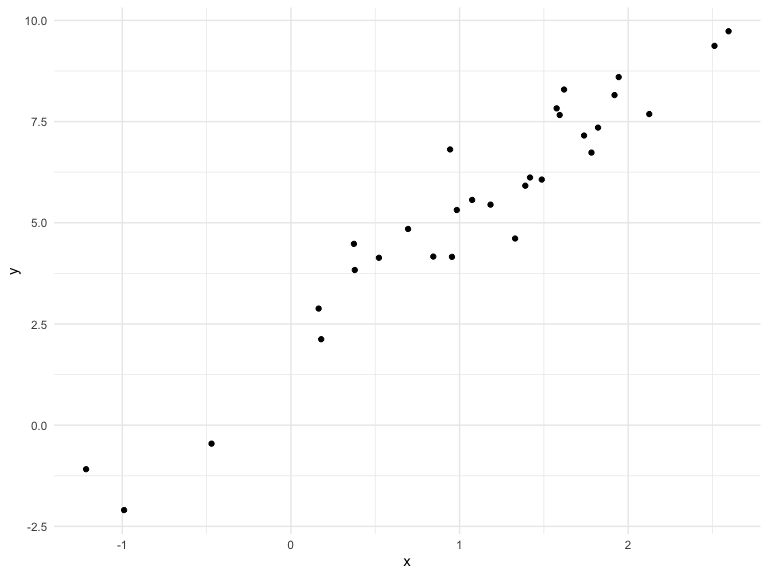

Writing Functions
================

## Get start

we are going to write some functions

calculating z-scores

``` r
x = rnorm(n = 30, mean = 4, sd = 2.3)
x_again = rnorm(n = 30, mean = 6, sd = 0.3)

(x - mean(x)) / sd(x)
```

    ##  [1] -0.767120446  0.109493425 -0.993470503  1.637039863  0.267334741
    ##  [6] -0.977065475  0.438222871  0.709719461  0.533829741 -0.419692475
    ## [11]  1.546684110  0.332624325 -0.761479160 -2.485776741  1.128069748
    ## [16] -0.137851865 -0.106748415  0.932105430  0.799422547  0.553437533
    ## [21]  0.905205442  0.757128408 -0.008541293 -2.241925304  0.581490604
    ## [26] -0.149966223 -0.257816586 -1.680744021 -0.606639531  0.363029790

``` r
(x_again - mean(x_again)) / sd(x_again)
```

    ##  [1]  1.5413954 -0.2961850  0.3204956 -0.2345965 -1.8983946 -0.6887392
    ##  [7] -0.6627062 -0.2415224  1.2161757  0.7926368 -0.3738088 -0.4855096
    ## [13]  0.7093845  0.5329776 -1.0329536 -1.0565157  0.2914637  0.7993727
    ## [19] -0.3082034  0.9409190  0.3336151 -0.9364778  0.2619634 -1.5869527
    ## [25]  1.6348722  2.3231173 -0.6286716 -1.4797904  0.5493942 -0.3367558

Now a function

``` r
z_score = function(x_arg) {
  (x_arg - mean(x_arg)) / sd(x_arg)
}
```

Try the
    function

``` r
z_score(x_arg = x_again)
```

    ##  [1]  1.5413954 -0.2961850  0.3204956 -0.2345965 -1.8983946 -0.6887392
    ##  [7] -0.6627062 -0.2415224  1.2161757  0.7926368 -0.3738088 -0.4855096
    ## [13]  0.7093845  0.5329776 -1.0329536 -1.0565157  0.2914637  0.7993727
    ## [19] -0.3082034  0.9409190  0.3336151 -0.9364778  0.2619634 -1.5869527
    ## [25]  1.6348722  2.3231173 -0.6286716 -1.4797904  0.5493942 -0.3367558

``` r
z_score(x_arg = 3)
```

    ## [1] NA

``` r
z_score(x_arg = "my name is jeff")
```

    ## Error in x_arg - mean(x_arg): non-numeric argument to binary operator

``` r
z_score(x_arg = c(TRUE, TRUE, FALSE, TRUE))
```

    ## [1]  0.5  0.5 -1.5  0.5

Here, we receive a lot errors when using the functions. Thus, we want to
add some conditions to our fucntion.

``` r
z_score = function(x_arg) {
  
  if (!is.numeric(x_arg)) {
    stop("x should be numeric")
  } else if (length(x_arg) == 1) {
    stop("x should be larger than 3")
  }
  
  (x_arg - mean(x_arg)) / sd(x_arg)
  
}
```

Try the function
    again

``` r
z_score(x_arg = x_again)
```

    ##  [1]  1.5413954 -0.2961850  0.3204956 -0.2345965 -1.8983946 -0.6887392
    ##  [7] -0.6627062 -0.2415224  1.2161757  0.7926368 -0.3738088 -0.4855096
    ## [13]  0.7093845  0.5329776 -1.0329536 -1.0565157  0.2914637  0.7993727
    ## [19] -0.3082034  0.9409190  0.3336151 -0.9364778  0.2619634 -1.5869527
    ## [25]  1.6348722  2.3231173 -0.6286716 -1.4797904  0.5493942 -0.3367558

``` r
z_score(x_arg = 3)
```

    ## Error in z_score(x_arg = 3): x should be larger than 3

``` r
z_score(x_arg = "my name is jeff")
```

    ## Error in z_score(x_arg = "my name is jeff"): x should be numeric

``` r
z_score(x_arg = c(TRUE, TRUE, FALSE, TRUE))
```

    ## Error in z_score(x_arg = c(TRUE, TRUE, FALSE, TRUE)): x should be numeric

## Multiple outputs

``` r
mean_and_sd = function(input_x) {
  
  if (!is.numeric(input_x)) {
    stop("x should be numeric")
  } else if (length(input_x) == 1) {
    stop("x should be larger than 3")
  }
  
  list(
    mean_input = mean(input_x),
    sd_input = sd(input_x),
    z_score = (input_x - mean(input_x)) / sd(input_x)
  )
  
}
```

test the function

``` r
mean_and_sd(input_x = x)
```

    ## $mean_input
    ## [1] 4.189654
    ## 
    ## $sd_input
    ## [1] 2.125478
    ## 
    ## $z_score
    ##  [1] -0.767120446  0.109493425 -0.993470503  1.637039863  0.267334741
    ##  [6] -0.977065475  0.438222871  0.709719461  0.533829741 -0.419692475
    ## [11]  1.546684110  0.332624325 -0.761479160 -2.485776741  1.128069748
    ## [16] -0.137851865 -0.106748415  0.932105430  0.799422547  0.553437533
    ## [21]  0.905205442  0.757128408 -0.008541293 -2.241925304  0.581490604
    ## [26] -0.149966223 -0.257816586 -1.680744021 -0.606639531  0.363029790

## Multiple inputs

``` r
set.seed(1)
sim_data = tibble(
  x = rnorm(30, mean = 1, sd = 1),
  y = 2 + 3 * x + rnorm(30, 0, 1)
)

# check the data I created
sim_data %>% ggplot(aes(x = x, y = y)) + geom_point()
```

<!-- -->

``` r
# do a linear regression analysis
ls_fit = lm(y ~ x, data = sim_data)
  
beta0_hat = coef(ls_fit)[1]
beta1_hat = coef(ls_fit)[2]
```

the chunk of the code above is kind of redundant and not tidy, let’s use
a function

``` r
set.seed(50)

sim_regression = function(n, beta0, beta1) {
  sim_data = tibble(
    x = rnorm(n, mean = 1, sd = 1),
    y = beta0 + beta1 * x + rnorm(n, 0, 1)
  )

  ls_fit = lm(y ~ x, data = sim_data)
  tibble(
    beta0_hat = coef(ls_fit)[1],
    beta1_hat = coef(ls_fit)[2]
  )
}

sim_regression(30, 2, 3)
```

    ## # A tibble: 1 x 2
    ##   beta0_hat beta1_hat
    ##       <dbl>     <dbl>
    ## 1      1.47      3.21

## scrape the Amazon

``` r
url = "https://www.amazon.com/product-reviews/B00005JNBQ/ref=cm_cr_arp_d_viewopt_rvwer?ie=UTF8&reviewerType=avp_only_reviews&sortBy=recent&pageNumber=1"

dynamite_html = read_html(url)

review_titles = 
  dynamite_html %>%
  html_nodes("#cm_cr-review_list .review-title") %>%
  html_text()

review_stars = 
  dynamite_html %>%
  html_nodes("#cm_cr-review_list .review-rating") %>%
  html_text()

review_text = 
  dynamite_html %>%
    html_nodes(".review-text-content span") %>%
    html_text()

reviews = tibble(
  title = review_titles,
  stars = review_stars,
  text = review_text
)
```

this chunk of the code that get the information of page 1. But what if I
want the info from page 2, page3? Now, let’s use a function\!

``` r
read_page_reviews <- function(url) {
  
  h = read_html(url)
  
  review_titles = h %>%
    html_nodes("#cm_cr-review_list .review-title") %>%
    html_text()
  
  review_stars = h %>%
    html_nodes("#cm_cr-review_list .review-rating") %>%
    html_text() %>%
    str_extract("\\d") %>%
    as.numeric()
  
  review_text = h %>%
    html_nodes(".review-data:nth-child(4)") %>%
    html_text()
  
  tibble(
    title = review_titles,
    stars = review_stars,
    text = review_text
  )
}
```

``` r
read_page_reviews(url = "https://www.amazon.com/product-reviews/B00005JNBQ/ref=cm_cr_arp_d_viewopt_rvwer?ie=UTF8&reviewerType=avp_only_reviews&sortBy=recent&pageNumber=2")
```

    ## # A tibble: 10 x 3
    ##    title                                   stars text                      
    ##    <chr>                                   <dbl> <chr>                     
    ##  1 "Waste of money\n            "              1 Format: Prime VideoVerifi…
    ##  2 "Good movie\n            "                  5 Format: Prime VideoVerifi…
    ##  3 "A classic\n            "                   5 Format: Prime VideoVerifi…
    ##  4 "FRIKKEN SWEET MOVIE, GAWSH.\n        …     5 Format: Prime VideoVerifi…
    ##  5 "You gonna eat the rest of your tots?\…     5 Format: Prime VideoVerifi…
    ##  6 "Tina you fat lard come get some dinne…     5 Format: Prime VideoVerifi…
    ##  7 "Great family movie\n            "          5 Format: Blu-rayVerified P…
    ##  8 "Teens love it\n            "               5 Format: Prime VideoVerifi…
    ##  9 "Great\n            "                       5 Format: DVDVerified Purch…
    ## 10 "Great Movie, Bad Packaging\n         …     4 Format: Blu-rayVerified P…
